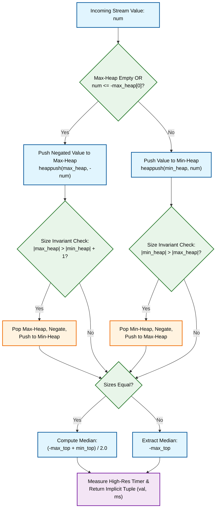

# Python *Baseline*: The Prototype Scripts

> **Context:**  The core algorithms are laid out here. Being free from strong type constraints, memory allocation, or compilation barriers, Python provides rapidly readable reference implementations. The latter sacrifice computing control for expressive freedom.

---

## Key Language-Specific Architectural Characteristics

* **Typing Model:** Dynamic and implicit. Variables require no declarations; containers accept arbitrary objects governed by Python's runtime object model.
* **Heap Abstraction:** Python lacks a native standalone binary heap class. 
For instance, the `heapq` module provides procedural min-heap functions operating on standard dynamic lists (`list`). Max-heap behavior is simulated via explicit value negation (\(\text{-num}\)).
* **Returning tuples:** Implicit tuple allocation and unpacking (`return running_val, elapsed_ms`), relying on dynamic object packing.

---

# 1. The **`streaming_stats`** app

## Pseudocode: 
* **Purpose:** Compute the running median of a data stream in 
$O(\log~n)$ 
time per element using a balanced two-heap architecture.
* **Input:** A sequential data stream 
```math
\text{data\_stream} = \[x_1, x_2, \dots, x_n\]
```
where each ingested value $\text{num} \in \mathbb{R}$.
* **Output:** Per-element return tuple 
```math
(\text{running\_val}, \text{elapsed\_ms}) \in \mathbb{R} \times \mathbb{R}^+
```

### State Initialization

```math
\text{max\_heap} \leftarrow []
\\
\text{min\_heap} \leftarrow []
```

### Step 1: Heap Selection & Insertion

For an incoming value $\text{num}$:

```math

\text{if } \neg\text{max\_heap} \lor \text{num} \le -\text{max\_heap}[0] \implies \text{heappush}(\text{max\_heap}, -\text{num})
\\
\text{else} \implies \text{heappush}(\text{min\_heap}, \text{num})

``` 

### Step 2: Size Invariant & Rebalancing

Maintain invariant 

```math
|\text{max\_heap}| \in \{|\text{min\_heap}|, |\text{min\_heap}| + 1\}:
\\
\text{if } \text{len}(\text{max\_heap}) > \text{len}(\text{min\_heap}) + 1 \implies \text{val} \leftarrow -\text{heappop}(\text{max\_heap}), \; \text{heappush}(\text{min\_heap}, \text{val})
\\
\text{elif } \text{len}(\text{min\_heap}) > \text{len}(\text{max\_heap}) \implies \text{val} \leftarrow 
\text{heappop}(\text{min\_heap}), \; \text{heappush}(\text{max\_heap}, -\text{val})

``` 

### Step 3: Running Statistic Computation

```math

\text{running\_val} = \frac{-\text{max\_heap}[0] + \text{min\_heap}[0]}{2.0} \quad (\text{if sizes are equal})
\\
\text{running\_val} = -\text{max\_heap}[0] \quad (\text{otherwise})

```

### Step 4: Timing, Return, and Stream Loop

```math

\text{elapsed\_ms} = (\text{perf\_counter}() - t_{\text{start}}) \times 1000.0
\\
\text{return } (\text{running\_val}, \text{elapsed\_ms})
\\
\forall x_i \in \text{data\_stream}: (\text{res}, \text{t\_ms}) \leftarrow \text{insert}(x_i)

``` 
---

## Flowchart

> **Color-Coding Guide (Anticipating C++ Evolutions):**
> * 🟦 **Blue Nodes:** Container & Memory Management (Mapped to C++ STL Containers / Adapters)
> * 🟩 **Green Nodes:** Predicates & Selection Logic (Mapped to C++ Concepts / Type Constraints)
> * 🟧 **Orange Nodes:** Rebalancing & State Transformation (Mapped to C++ Move Semantics / Swap Operations)
> * 🟪 **Purple Nodes:** Return Domain & Unpacking (Mapped to C++ Structured Bindings / Typed Structs)


